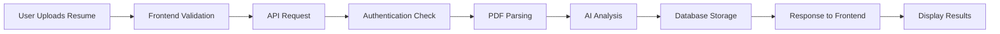

<div align="center">

# 🎯 HireLens AI

### ✨ AI-Powered Resume Analysis & Interview Preparation Platform

[](https://opensource.org/licenses/ISC)
[](https://www.typescriptlang.org/)
[](https://nodejs.org/)
[](https://nextjs.org/)

**Transform your job search with AI-driven resume analysis, personalized interview preparation, and actionable skill gap insights.**

[🚀 Get Started](#-getting-started) • [📚 Documentation](#-documentation) • [🎨 Features](#-features) • [🏗️ Architecture](#-architecture)

</div>

---

## 🌟 Overview

HireLens AI is an intelligent platform that matches your resume against real job descriptions, providing objective eligibility scoring and personalized interview preparation strategies. Powered by Google Gemini AI, it delivers comprehensive analysis to help you land your dream job.

### 🎯 Key Benefits

- **🤖 AI-Powered Analysis**: Leverage Google Gemini 2.5 Flash for intelligent resume evaluation
- **📊 Objective Scoring**: Get accurate match scores based on job requirements
- **🧠 Smart Preparation**: Receive tailored technical and behavioral interview questions
- **🔍 Skill Gap Detection**: Identify and address missing skills with severity levels
- **📚 Personalized Roadmaps**: Follow day-by-day preparation plans for success
- **🔒 Secure & Private**: Enterprise-grade security with JWT authentication

---

## ✨ Features

### 🎨 Surface Frontend

<div align="center">

**Modern React-Based User Interface**

</div>

#### 🎯 Smart Resume Analysis
- **AI-Powered Matching**: Upload your resume and get instant insights into how well your profile matches specific job roles
- **Compatibility Scoring**: Receive a detailed match percentage that objectively evaluates your fit for a position
- **Multi-Format Support**: Upload resumes in PDF, DOC, DOCX, or TXT format (up to 5MB)

#### 📝 Comprehensive Job Evaluation
- **Job Description Input**: Paste complete job descriptions or role requirements for accurate analysis
- **Self Description/Bio**: Add your personal summary, key accomplishments, and career goals to enhance matching accuracy
- **Real-Time Validation**: Instant feedback on input requirements with word count tracking

#### 📊 Detailed Analysis Results
- **Match Score Dashboard**: Visual representation of your job compatibility with color-coded indicators
  - 🟢 **80%+**: High match
  - 🔵 **60-79%**: Medium match
  - 🟠 **Below 60%**: Low match

#### 🧠 Interview Preparation
- **Technical Questions**: AI-generated technical interview questions tailored to the specific job role
  - Each question includes the intention behind it and suggested answers
  - Expandable format for detailed study
  - Search functionality to find specific topics

- **Behavioral Questions**: Curated behavioral interview questions with:
  - Question context and interviewer intention
  - Model answers for effective preparation
  - STAR method guidance

#### 🔍 Skill Gap Analysis
- **Identified Gaps**: Comprehensive analysis of missing or underdeveloped skills
- **Severity Levels**: Skill gaps categorized by impact:
  - 🔹 **LOW**: Nice-to-have skills
  - 🔸 **MEDIUM**: Important for the role
  - 🔺 **HIGH**: Critical requirements
- **Actionable Insights**: Clear identification of areas needing improvement

#### 📚 Personalized Preparation Plans
- **Day-by-Day Roadmap**: Structured study plans with daily focus areas
- **Task Checklists**: Specific tasks to complete each day
- **Progress Tracking**: Interactive checkboxes to track your preparation progress
- **Persistent Storage**: Your progress is saved locally for continuity

#### 📋 Evaluation Management
- **Review History**: Access all past job evaluations in one place
- **Search & Filter**: Quickly find specific evaluations by job title
- **Sorting Options**: Organize reviews by date, score, or relevance
- **Delete Evaluations**: Remove outdated or unwanted analyses

#### 🎨 Modern User Interface
- **Responsive Design**: Seamless experience across desktop, tablet, and mobile devices
- **Dark Mode Support**: Automatic theme adaptation for comfortable viewing
- **Smooth Animations**: Engaging micro-interactions and transitions
- **Intuitive Navigation**: Clear user flow from analysis to review

---

### ⚙️ Core Backend

<div align="center">

**Robust Node.js/Express API Server**

</div>

#### 🔐 Authentication System
- **User Registration**: Secure sign-up with email, username, and password
- **User Login**: JWT-based authentication with HTTP-only cookies
- **Token Management**: Access tokens (7 days) and refresh tokens (30 days)
- **Token Refresh**: Automatic token rotation for seamless user experience
- **Secure Logout**: Cookie clearing and token invalidation
- **Password Security**: bcrypt hashing for secure password storage

#### 🧠 AI-Powered Resume Analysis
- **Google Gemini Integration**: Uses Google Gemini 2.5 Flash for intelligent analysis
- **PDF Resume Parsing**: Extracts text content from uploaded PDF resumes
- **Multi-Format Support**: Handles PDF, DOC, DOCX, and TXT file formats
- **Structured Output**: JSON-based response with validated schema using Zod
- **Intelligent Prompts**: Expert interview coach prompts for accurate analysis

#### 📊 Comprehensive Analysis Generation
- **Match Score Calculation**: Objective 0-100 compatibility score based on resume-job alignment
- **Technical Questions**: AI-generated technical interview questions with detailed guidance
- **Behavioral Questions**: Curated behavioral interview questions for personality assessment
- **Skill Gap Analysis**: Identification of missing skills with severity levels
- **Preparation Plans**: Day-by-day study roadmaps with specific tasks

#### 🛡️ Security & Middleware
- **Authentication Middleware**: JWT verification for protected routes
- **Input Validation**: Zod schema validation for all API inputs
- **Error Handling**: Centralized error handling with custom error classes
- **CORS Configuration**: Cross-origin resource sharing with credentials
- **Cookie Security**: HTTP-only, secure, same-site cookies

---

## 🏗️ Architecture

### 📁 Project Structure

```
HireLens-AI/
├── apps/
│   ├── surface/              # Next.js Frontend Application
│   │   ├── src/
│   │   │   ├── app/         # Next.js App Router
│   │   │   ├── components/  # React Components
│   │   │   ├── hooks/       # Custom React Hooks
│   │   │   ├── lib/         # Utility Functions
│   │   │   ├── services/    # API Services
│   │   │   └── types/       # TypeScript Types
│   │   └── package.json
│   │
│   └── core/                # Express Backend Server
│       ├── src/
│       │   ├── modules/     # Feature Modules
│       │   │   ├── auth/    # Authentication
│       │   │   ├── analysis/# Resume Analysis
│       │   │   ├── user/    # User Management
│       │   │   └── ai/      # AI Integration
│       │   ├── common/      # Shared Utilities
│       │   ├── config/      # Configuration
│       │   ├── app.ts       # Express App
│       │   └── server.ts    # Server Entry
│       └── package.json
│
├── packages/                # Shared Packages
├── infra/                   # Infrastructure Code
├── turbo.json              # Turborepo Configuration
└── package.json            # Root Package Configuration
```

### 🔄 Data Flow



### 🎯 Technology Stack

#### Frontend (Surface)
| Technology | Purpose |
|------------|---------|
| **Next.js 16** | React Framework for optimal performance |
| **TypeScript** | Type-safe development |
| **Tailwind CSS** | Modern utility-first styling |
| **shadcn/ui** | Beautiful, accessible component library |
| **Motion** | Smooth animations and transitions |
| **Zustand** | Lightweight state management |
| **React Hook Form** | Efficient form handling with validation |
| **Lucide React** | Modern icon library |

#### Backend (Core)
| Technology | Purpose |
|------------|---------|
| **Node.js 22** | JavaScript runtime environment |
| **Express 5** | Fast, minimalist web framework |
| **TypeScript** | Type-safe development with strict typing |
| **Google Gemini AI** | AI-powered resume analysis |
| **JWT** | Secure token-based authentication |
| **bcrypt** | Secure password hashing |
| **Zod** | Schema validation and type inference |
| **pdf-parse** | PDF text extraction |

---

## 🚀 Getting Started

### 📋 Prerequisites

- **Node.js** 22.x or higher
- **pnpm** package manager
- **Google Gemini API Key**
- Database credentials (PostgreSQL/MySQL)

### 🔧 Installation

1. **Clone the repository**
   ```bash
   git clone https://github.com/yourusername/HireLens-AI.git
   cd HireLens-AI
   ```

2. **Install dependencies**
   ```bash
   pnpm install
   ```

3. **Environment Setup**
   
   Create `.env` files in both apps:
   
   **Core Backend** (`apps/core/.env`):
   ```env
   PORT=8000
   NODE_ENV=development
   CORS_ORIGIN=http://localhost:3000
   GOOGLE_GEMINI_API_KEY=your_gemini_api_key
   DATABASE_HOST=localhost
   DATABASE_PORT=5432
   DATABASE_NAME=hirelens
   DATABASE_USER=your_db_user
   DATABASE_PASSWORD=your_db_password
   JWT_SECRET=your_jwt_secret
   JWT_REFRESH_SECRET=your_refresh_secret
   ```
   
   **Surface Frontend** (`apps/surface/.env`):
   ```env
   NEXT_PUBLIC_API_URL=http://localhost:8000
   ```

4. **Database Setup**
   ```bash
   # Run database migrations
   pnpm --filter core db:migrate
   ```

### 🎬 Running the Application

#### Development Mode

```bash
# Start all applications
pnpm dev

# Or start specific applications
pnpm --filter core dev      # Backend only
pnpm --filter surface dev   # Frontend only
```

#### Production Build

```bash
# Build all applications
pnpm build

# Start production servers
pnpm start
```

### 🌐 Access Points

- **Frontend**: http://localhost:3000
- **Backend API**: http://localhost:8000
- **Health Check**: http://localhost:8000/health

---

## 📚 API Documentation

### 🔐 Authentication Endpoints

#### POST `/api/v1/auth/signup`
Register a new user account.

**Request Body:**
```json
{
  "userName": "johndoe",
  "email": "john@example.com",
  "password": "securePassword123"
}
```

#### POST `/api/v1/auth/signin`
Authenticate user and issue tokens.

**Request Body:**
```json
{
  "email": "john@example.com",
  "password": "securePassword123"
}
```

#### GET `/api/v1/auth/me`
Get current authenticated user profile.

**Headers:**
```
Cookie: accessToken=your_token
```

### 📊 Analysis Endpoints

#### POST `/api/v1/analysis/review`
Generate a new resume analysis review.

**Request:** Multipart form data
- `resume`: File (PDF, DOC, DOCX, TXT)
- `jobDescription`: String
- `selfDescription`: String

**Response:**
```json
{
  "id": "review_123",
  "matchScore": 85,
  "title": "Software Engineer",
  "technicalQuestions": [...],
  "behavioralQuestions": [...],
  "skillGaps": [...],
  "preparationPlan": [...]
}
```

#### GET `/api/v1/analysis/all/review`
Get all reviews for the authenticated user.

#### GET `/api/v1/analysis/:reviewId/review`
Get detailed review by ID.

#### DELETE `/api/v1/analysis/:reviewId/review`
Delete a specific review.

---

## 🎨 How It Works

### 📝 Step-by-Step Process

#### 1️⃣ **Upload Resume**
- Navigate to the analyze page
- Upload your resume (PDF, DOC, DOCX, or TXT)
- Paste the job description
- Add your self-description/bio

#### 2️⃣ **AI Analysis**
- Server extracts text from your resume
- Data is sent to Google Gemini AI
- AI analyzes compatibility with job requirements
- Generates comprehensive evaluation report

#### 3️⃣ **Review Results**
- View your match score (0-100%)
- Study technical interview questions
- Prepare for behavioral questions
- Identify skill gaps with severity levels

#### 4️⃣ **Follow Preparation Plan**
- Access your personalized study roadmap
- Complete daily tasks
- Track progress with interactive checkboxes
- Return anytime to continue preparation

#### 5️⃣ **Manage Evaluations**
- Access all past evaluations
- Search and filter by job title
- Compare match scores across roles
- Delete outdated analyses

---

## 🔒 Security Features

### 🛡️ Backend Security
- **HTTP-Only Cookies**: Tokens stored in secure, HTTP-only cookies
- **Secure Flag**: Cookies marked secure in production
- **Same-Site Strict**: CSRF protection via same-site cookie policy
- **Password Hashing**: bcrypt with appropriate salt rounds
- **Token Expiration**: Short-lived access tokens with refresh token rotation
- **Input Validation**: All inputs validated against Zod schemas
- **CORS Configuration**: Controlled cross-origin access

### 🔐 Frontend Security
- **Environment Variables**: Sensitive data stored in environment variables
- **API Communication**: Secure HTTPS communication in production
- **Input Sanitization**: Client-side validation before API calls
- **Error Handling**: Graceful error handling without exposing sensitive data

---

## 🤝 Contributing

We welcome contributions! Please follow these steps:

1. Fork the repository
2. Create a feature branch (`git checkout -b feature/amazing-feature`)
3. Commit your changes (`git commit -m 'Add amazing feature'`)
4. Push to the branch (`git push origin feature/amazing-feature`)
5. Open a Pull Request

### 📝 Development Guidelines
- Follow the existing code style
- Write meaningful commit messages
- Add tests for new features
- Update documentation as needed

---

## 📄 License

This project is licensed under the ISC License - see the [LICENSE](LICENSE) file for details.

---

## 👥 Team

- **Kunal Bhalerao** - *Lead Developer*

---

## 🙏 Acknowledgments

- **Google Gemini AI** for powering the intelligent analysis
- **Next.js Team** for the amazing React framework
- **shadcn/ui** for the beautiful component library
- **Turborepo** for the efficient monorepo management

---

<div align="center">

### ⭐ Star this repository if it helped you!

### 🚀 Built with ❤️ using Next.js, Express, and Google Gemini AI

</div>